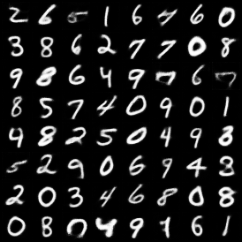
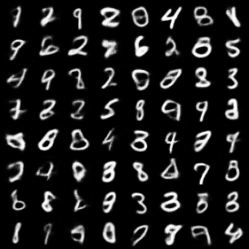
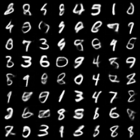
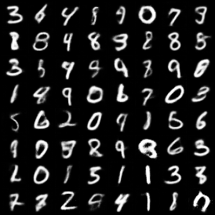

# Project 3: Exploring Diffusion Models: From Latent Space to Multimodal Synthesis


## Dependencies

Set up your environment and install dependencies to run the training scripts.

```bash
conda create -n cs290u_hw3 python=3.11
conda activate cs290u_hw3

pip install -r requirements.txt
```

## Quickstart

```bash
# 1) VAE (reconstruction + random samples per epoch)
python train_vae.py --epochs 40 --kl-weight 0.5

# 2) Latent diffusion (requires VAE ckpt from step 1)
python train_latent_diffusion.py --epochs 40 --vae_ckpt result/vae/convae_latest.pt 

# 3) CLIP (image↔label alignment on MNIST)
python train_clip.py --epochs 10 

# 4) Tiny text-conditioned Stable Diffusion on MNIST (requires CLIP ckpt)
python train_tiny_sd.py --epochs 40 --clip_ckpt result/clip/clip_latest.pt 
```

Outputs are written to `result/<module>/` with per-epoch sample grids and latest/best checkpoints, as noted in each section below.


## VAE

<!-- **You may need to adjust `kl-weight` to analyze the VAE** -->
<span style="color:#d32f2f"><strong>You may need to adjust `kl-weight` to analyze the VAE.</strong></span>

- Files: `train_vae.py`, `HW3/vae.py`
- Model: `ConvVAE` operates on 1×32×32 MNIST. Saves random samples and optional reconstructions per epoch.

Run
```bash
python train_vae.py \
	--data-dir data/MNIST \
	--output-dir result/vae \
	--epochs 40 \
	--batch-size 128 \
	--lr 2e-4 \
	--latent-dim 100 \
	--kl-weight 1 \
	--loss-type mse \
	--num-workers 4 \
	--seed 42 \
	--save-recon                # add --no-save-recon to disable
```

Key arguments
- `--latent-dim`: latent size (default 100)
- `--kl-weight`: weight for KL term (default 1)
- `--loss-type`: `mse` or `bce` (decoder outputs sigmoid probs)
- `--no-cuda`: force CPU

Outputs (under `result/vae/`)
- `samples_epoch_XXX.png`: random samples from the prior at each epoch
- `recon_epoch_XXX.png`: reconstructions (if `--save-recon`)
- `convae_latest.pt`, `convae_best.pt`: model checkpoints

### Example Outputs

<!-- 
  -->

<table>
	<tr>
		<td align="center" width="48%">
			
			<div><sub>Reconstruction Result</sub></div>
		</td>
		<td width="4%"></td>
		<td align="center" width="48%">
			
			<div><sub>Sample Result</sub></div>
		</td>
	</tr>
</table>

## DDPM and DDIM

<span style="color:#d32f2f"><strong>To do: complete the code in `HW3/diffusion.py:120`.</strong></span>

- Files: `train_diffusion.py`, `HW3/diffusion.py`, `HW3/Unet.py`
- Model: small UNet predicts noise ε. Per-epoch sampling saves both DDPM and DDIM grids.

Run
```bash
python train_diffusion.py \
	--data_dir ./data \
	--batch_size 128 \
	--epochs 20 \
	--lr 1e-4 \
	--timesteps 1000 \
	--ddim_steps 200 \
	--ddim_eta 0.0 \
	--out_dir result/diffusion
```

Outputs (under `result/diffusion/`)
- `samples_ddpm_epoch_XXX.png`, `samples_ddim_epoch_XXX.png`
- `diffusion_latest.pt`

### Example Outputs

<table>
	<tr>
		<td align="center" width="48%">
			
			<div><sub>DDPM</sub></div>
		</td>
		<td width="4%"></td>
		<td align="center" width="48%">
			
			<div><sub>DDIM</sub></div>
		</td>
	</tr>

</table>


## Latent Space Diffusion

- Files: `train_latent_diffusion.py`, `HW3/vae.py`, `HW3/diffusion.py`
- Idea: learn diffusion in VAE latent space with a small MLP ε-predictor, then decode via VAE.
- Requires a trained VAE checkpoint. By default it looks for `result/vae/convae_latest.pt`.

Run
```bash
# First make sure the VAE is trained (see VAE section)
python train_latent_diffusion.py \
	--data_dir ./data \
	--vae_ckpt result/vae/convae_latest.pt \
	--epochs 40 \
	--lr 1e-4 \
	--timesteps 1000 \
	--ddim_steps 200 \
	--ddim_eta 0.0 \
	--out_dir result/latent_diffusion \
	--canonicalize            # optional: stabilize sign in latent space
```

Key arguments
- `--vae_ckpt`: path to VAE checkpoint to load (required if not at default)
- `--latent_dim`: inferred from VAE ckpt if not specified
- `--canonicalize`: per-sample sign canonicalization in latent space (see `ConvVAE.canonicalize_latent`)
- ε-MLP sizes: `--time_dim` (default 256) and `--hidden_dim` (default 512)

Outputs (under `result/latent_diffusion/`)
- `samples_ddpm_epoch_XXX.png`, `samples_ddim_epoch_XXX.png`
- `latent_diffusion_latest.pt`

### Example Outputs

It should be similar to DDPM results.

## CLIP

- Files: `train_clip.py`, `HW3/clip.py`
- Model: Tiny CLIP—CNN image encoder + learned label embeddings for digits 0–9.

Run
```bash
python train_clip.py \
	--data_dir ./data \
	--epochs 10 \
	--batch_size 256 \
	--embed_dim 128 \
	--lr 1e-3 \
	--weight_decay 1e-4 \
	--out_dir result/clip
```

Outputs (under `result/clip/`)
- `clip_latest.pt`: last epoch
- `clip_best.pt`: best validation accuracy


## Tiny MNIST Stable Diffusion (text-conditioned)

<span style="color:#d32f2f"><strong>To do: complete the code in `train_tiny_sd.py:64`.</strong></span>

- Files: `train_tiny_sd.py`, `HW3/diffusion.py`, `HW3/clip.py`
- Conditioning: CLIP text encoder provides class embeddings for labels 0–9.

Run
```bash
# Train CLIP first (see CLIP section) and ensure the checkpoint path below exists
python train_tiny_sd.py \
	--data_dir ./data \
	--clip_ckpt result/clip/clip_latest.pt \
	--embed_dim 128 \
	--epochs 40 \
	--lr 2e-4 \
	--timesteps 1000 \
	--ddim_steps 50 \
	--ddim_eta 0.0 \
	--out_dir result/tiny_sd
```

Important
- `--embed_dim` must match the CLIP checkpoint’s embedding dimension.

Outputs (under `result/tiny_sd/`)
- `samples_epoch_XXX.png`: 80 samples (8×10 grid, rows are 0..9)
- `tiny_sd_latest.pt`

### Example Outputs

<table>
	<tr>
		<td align="center" width="96%">
			
			<div><sub>tiny SD</sub></div>
		</td>
	</tr>
</table>
